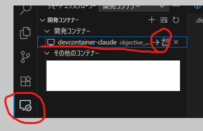
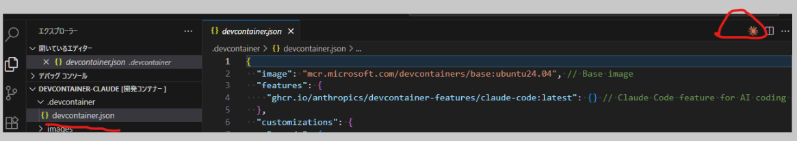

# Windows環境でClaude CodeをDevContainerで動かす方法

DevContainerを利用してWindows環境でClaude Codeを簡単かつ確実に動作させる手順を説明します。

## 前提条件

以下がインストールされていることを確認してください：
- Rancher Desktop
- Visual Studio Code
- Dev Containers拡張機能

## セットアップ手順

### 1. リポジトリのクローン
```bash
git clone <このリポジトリのURL>
cd devcontainer-claude
```

### 2. DevContainerでの起動
1. VS Codeで`devcontainer-claude`フォルダを開く
2. コマンドパレット（Ctrl+Shift+P）で「Dev Containers: Reopen in Container」を選択
3. DevContainerが自動的にビルドされ、Claude Codeが利用可能になります






## Git設定（初回のみ）

DevContainer内でGitを使用する場合：

```bash
# 安全なディレクトリとして登録
git config --global --add safe.directory /workspaces/devcontainer-claude

```

## 設定内容

### DevContainer設定
- Ubuntu 24.04ベースイメージ
- Claude Code機能の自動インストール
- JSONファイルのフォーマット設定

### CLAUDE.mdファイル
Claude Codeが効率的に作業するための設定：
- 日本語での会話強制
- 安全な開発ガイドライン
- プロジェクト固有の制約事項

## カスタマイズ

特定の言語・フレームワーク用の環境が必要な場合は、[containers.dev/features](https://containers.dev/features)から必要な機能を選んで`.devcontainer/devcontainer.json`の`features`セクションに追加してください。

## 参考

- [Windows 上の DevContainer で簡単に Claude Code 動かす方法](https://zenn.dev/taichi/articles/a4ea249f7d0f6b)
