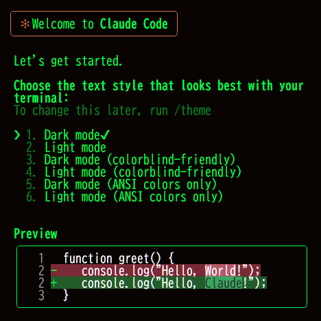

# Claude Code を Windows 上で DevContainer で動かす方法

この記事では、DevContainer を利用して Windows 環境でも Claude Code を簡単かつ確実に動作させる手順を説明します。

## 前提条件

- `Rancher Desktop` がインストールされていること
  `Visual Studio Code` および `Dev Containers 拡張機能` がインストールされていること

## セットアップ手順

1. **このリポジトリをクローン**
   `bash
git clone <このリポジトリのURL>
cd devcontainer-claude
    `

2. **VS Code でフォルダを開く**

   - VS Code で`devcontainer-claude`フォルダを開きます。
   - `Dev Containers`かコンテナを開始する

- 

  - `devcontainer.json`を選択して`Run Claude Code`を開始する

-

)

3. **Claude Code の利用**
   - コンテナ内で Claude Code が利用可能になります。

## Git設定手順

DevContainer内でGitを使用する場合の設定手順：

### 1. 安全なディレクトリとして登録
```bash
git config --global --add safe.directory /workspaces/devcontainer-claude
```

### 2. ユーザー情報を設定
```bash
git config --global user.name "あなたの名前"
git config --global user.email "your-email@example.com"
```

### 3. 基本的なGit操作
```bash
# 状態確認
git status

# ファイルをステージング
git add .

# コミット
git commit -m "コミットメッセージ"

# リモートリポジトリにプッシュ
git push origin main
```

### 注意事項
- DevContainerはホストのディレクトリをマウントしているため、コンテナ内での変更はホストに自動的に反映されます
- SSH認証を使用する場合は、SSH鍵がコンテナからアクセス可能である必要があります
- HTTPSを使用する場合は、認証情報の設定が必要な場合があります

## 実装済みプロジェクト

### テトリスゲーム (tetris-game/)

このリポジトリには、Next.js + TypeScript + Tailwind CSSで実装されたテトリスゲームが含まれています。

#### 特徴
- 完全に動作するテトリスゲーム
- 全テトリミノ（I, O, T, S, Z, J, L）対応
- キーボード操作（矢印キー、回転、ハードドロップ）
- スコア計算とレベルアップ機能
- ライン消去機能
- 一時停止とリスタート機能
- レスポンシブデザイン

#### 操作方法
- `←` `→` `↓` : テトリミノの移動
- `↑` または `X` : テトリミノの回転
- `Space` : ハードドロップ
- `P` または `Esc` : 一時停止/再開
- `R` : ゲームリスタート

#### 実行方法
```bash
cd tetris-game
npm install
npm run dev
```

#### ファイル構成
```
tetris-game/
├── src/
│   ├── components/          # UI コンポーネント
│   │   ├── GameBoard.tsx    # ゲーム盤面
│   │   ├── GameInfo.tsx     # スコア表示
│   │   ├── NextTetrominoPreview.tsx  # 次のテトリミノ表示
│   │   └── TetrisGame.tsx   # メインゲーム
│   ├── hooks/               # カスタムフック
│   │   ├── useGameLoop.ts   # ゲームループ
│   │   ├── useKeyboard.ts   # キーボード入力
│   │   └── useTetris.ts     # メインゲームロジック
│   ├── types/               # 型定義
│   │   └── tetris.ts        # テトリス関連の型
│   └── utils/               # ユーティリティ
│       └── tetrominos.ts    # テトリミノ形状定義
```

## 開発環境設定

### CLAUDE.md ファイル
このリポジトリには `CLAUDE.md` ファイルが含まれており、Claude Code が効率的に作業できるよう設定されています。

#### 主な設定
- 日本語での会話を強制
- ファイル更新時の承認要求
- 既存内容の保護（追加のみ）
- 機密情報の記録禁止
- プロジェクト慣習への準拠

### DevContainer 設定
`.devcontainer/devcontainer.json` で以下が設定されています：
- Ubuntu 24.04 ベースイメージ
- Claude Code 機能の自動インストール
- JSON ファイルのフォーマット設定

## 補足

- 特定の言語向けの開発環境にする方法
- https://containers.dev/features から必要な環境を選んで、`devcontainer.json` の `features` に追加しましょう。

## 参考

-[Windows 上の DevContainer で簡単に Claude Code 動かす方法](https://zenn.dev/taichi/articles/a4ea249f7d0f6b)
